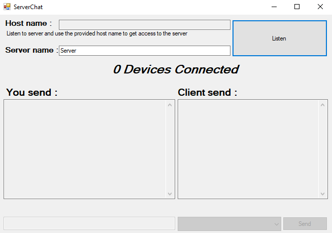
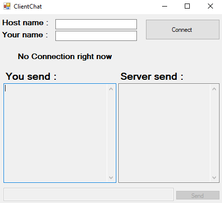

# Chatos

A simple client/server chat applications uses ***CSharp Sockets Programming*** and it was a practice in this topic

# To Run The applications
1. **Clone** the repo .
2. **Go** to `Chatos\ChatosServer\ChatosServer\bin\Debug` .
3. **Run** `ChatosServer.exe` on the server machine to start the server app.
4. **Press** on **Listen** button to get the host name.
5. **Go** to `Chatos\ChatosClient\ChatosClient\bin\Debug` .
6. **Run** `ChatosClient.exe` to run a client app on the client machine.
7. **Put** The host name which you have get from the server app and your name in the specified fields.
8. **Press** on **Connect** button and then start chating 😄.